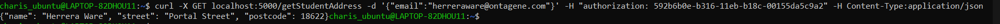
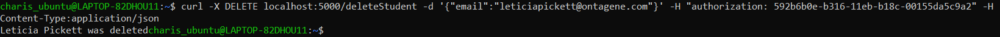

# Ergasia_1_e18011_Antoniadi_Charis
This project is about executing queries for a Mongodb database using the pymongo module of python. The app.py file contains nine endpoints, each used for the POST, GET, PATCH and DELETE HTTP methods.

## Preparation
Firstly we need to open a terminal window to start docker
```bash
sudo dockerd
```
In a new terminal window, we type the commands bellow
```bash
sudo docker pull mongo #to pull the image from docker hub
sudo docker pull mongo:4.0.4 #to download the latest version of MONGODB image
sudo docker run -d -p 27017:27017 --name mongodb mongo:4.0.4 #to deploy image for the first time
sudo docker start mongodb #to start mongodb
```
Then we are going to use the Mongo Shell to create the InfoSys database, which will contain two collections. The fist one is called Students and contains the students.json file and the second one is called Users and contains the users.json file. To access the mongo shell we type:
```bash
sudo docker exec -it mongodb mongo
```
In Mongo Shell we type:
```bash
use InfoSys #to create InfoSys db
sudo docker cp students.json mongodb:/students.json #to copy data from host to container
docker exec -it mongodb mongoimport --db=InfoSys --collection=Students --file=students.json #to add the file to Students collection
sudo docker cp users.json mongodb:/users.json #to copy data from host to container
docker exec -it mongodb mongoimport --db=InfoSys --collection=Users --file=users.json #to add the file to Users collection
```
When we are ready to run the project, we use the command python3 followed by the file name, as seen below

```bash
python3 app.py
```
*note: If the app.py file isn't located in the default path, we use the cd command in order to relocate to the directory where the file is located.*

## Execution
### Create User (POST)
In order to execute all the endpoints, we have to create a user to add to the Users collection, who has the login info given by the user in a new terminal window by typing the command:
```bash
curl -X POST localhost:5000/createUser -d '{"username":"insert username here", "password":"insert password here"}' -H Content-Type:application/json
```
The result if there is no other entry in the collection with the given username, will be a success response as seen in the image bellow

In case the given username already exist, the output will be a corresponding response.

### Login (POST)
Now, the user needs to be logged in. This will happen by typing the command:
```bash
curl -X POST localhost:5000/login -d '{"username":"insert username here", "password":"insert password here"}' -H Content-Type:application/json
```
If the login information are correct then a success message followed by the user's session uuid and username will show up


### Get student (GET)
If we want to print the information of a student with a specific email, then in the terminal window we type:
```bash
curl -X GET localhost:5000/getStudent -d '{"email":"insert email here"}' -H "authorization: the user's uuid (printed in the terminal after the successful execution of the login query)" -H Content-Type:application/json
```
The result should look like the image bellow


### Get students thirties (GET)
If we want to print the information of enery user born in the year 1991, we type the command:
```bash
curl -X GET localhost:5000/getStudents/thirties -H "authorization: the user's uuid (printed in the terminal after the successful execution of the login query)" -H Content-Type:application/json
```
Every student that satisfies the requirements will be printed, as shown bellow

If there is no student born in that year a corresponding response will show up

### Get students oldies (GET)
If we want to print the information of enery user born in the year 1991 or earlier, we type the command:
```bash
curl -X GET localhost:5000/getStudents/oldies -H "authorization: the user's uuid (printed in the terminal after the successful execution of the login query)" -H Content-Type:application/json
```
Every student that satisfies the requirements will be printed, as shown bellow

If there is no student born in that year or earlier a corresponding response will show up

### Get student address (GET)
To get the name, street and postcode of a student with a specific email address, we have to type:
```bash
curl -X GET localhost:5000/getStudentAddress -d '{"email":"insert email here"}' -H "authorization: the user's uuid (printed in the terminal after the successful execution of the login query)" -H Content-Type:application/json
```
If the student exist then the name, street and postcode keys alognside with their values will be printed

Else, if no student was found then a corresponding response will be printed

### Delete student (DELETE)
In case we want to delete a student with a specific email address, then we have to type:
```bash
curl -X DELETE localhost:5000/deleteStudent -d '{"email":"insert email here"}' -H "authorization: authorization: the user's uuid (printed in the terminal after the successful execution of the login query)" -H Content-Type:application/json
```
The query is executed successfully if the output is the name of the deleted student followed by the string "was deleted". An example is shown bellow

If the student doesn't exists then a corresponding response will be printed

### Add courses (PATCH)
To update a student from the collection by adding a number of courses and their grades to the student's information, we have to type the command:
```bash
curl -X PATCH localhost:5000/addCourses -d '{"email":"insert email here", "courses":[{"insert course's name":insert course's grade}, {"insert course's name":insert course's grade}, {"insert course's name":insert course's grade}]}' -H "authorization: the user's uuid (printed in the terminal after the successful execution of the login query)" -H Content-Type:application/json
```
If the the query was executed successfully, the output should be the name of the deleted student followed by the string "was update". An example is shown bellow


### Get passed courses (GET)
The final query in the app.py file is used to print the passed courses (courses graded with 5 or higher) of a student with a specific email address. To execute the query getPassedCourses, we type the command bellow to the terminal window
```bash
curl -X GET localhost:5000/getPassedCourses -d '{"email":"insert email here"}' -H "authorization: the user's uuid (printed in the terminal after the successful execution of the login query)"
-H Content-Type:application/json
```
In cases the student has't passed any of their courses or no student was found, a correspong response will show up.
But if the student has passed at least one of the declared courses then their name will show up, followed by the name of the passed course as well as its grade. An example is shown in the image bellow


*Every time a change has been made to the app.py file, to execute the third, forth, fifth, sixth, seventh, eighth or nineth query we need to execute the login query first in order to get the new session uuid*

## app.py
### Create User (POST)
If this is the first time we are going to run the app.py in order to execute all of the nine endopoints, we have to create a user to login and start the process with their creadentials. That's why we use the create_user function. Everytime a new user is created, there has to be a proof that there is no other person with the same username in the collection. The command in line 46 of the app.py file, ensures us that's the case, because after a search to the collection, the number of people with that exact username must equal to zero if we want the process of creating a user to continue. Then, if we pass that initial check a dictionary with the user's creadentials will be created and later on insert to the collection. Finally, a success response will be printed. On the other hand, if there's already a user with the same username the a corresponding message will be printed.
```python
if users.find({"username":data['username']}).count() == 0:
    user = {"username":data['username'], "password":data['password']}
    users.insert_one(user)
    return Response(data['username']+" was added to the MongoDB", status=200, mimetype='application/json')
else:
    return Response("A user with the given username already exists", status=400, mimetype='application/json')
```

### Login (POST)
After the user was successfully created, they need to be logged in (they need to be authenticated).
```python
if users.find_one({"$and":[ {"username":data['username']}, {"password":data['password']}]}):
    user_uuid = create_session(data['username'])
    res = {"uuid": user_uuid, "username": data['username']}
    return Response("Successful login "+ json.dumps(res),status=200, mimetype='application/json')
else:
    return Response("Wrong username or password.", status=400, mimetype='application/json')
```
### Get student (GET)
```python
uuid = request.headers.get('authorization')
authentication = is_session_valid(uuid)
if (authentication == False):
    return Response("Authentication Failed", status=401, mimetype='application/json')
else:
    student = students.find_one({"email":data['email']})
    if student != None:
        student['_id'] = None
        return Response(json.dumps(student), status=200, mimetype='application/json')
    return Response('No student with that email was found',status=500,mimetype='application/json')
```

### Get students thirties (GET)
```python
uuid = request.headers.get('authorization')
authentication = is_session_valid(uuid)
if (authentication == False):
    return Response("Authentication Failed", status=401, mimetype='application/json')
else:
    if (students.find({"yearOfBirth":{"$eq":1991}}).count() == 0):   
        return Response("No students born in 1991 were found", mimetype='application/json')
    else:
        iterable = students.find({"yearOfBirth":{"$eq":1991}})
        students_list = []
        for student in iterable:
            student['_id'] = None
            students_list.append(student)
    return Response(json.dumps(students_list), status=200, mimetype='application/json')
```

### Get students oldies (GET)
```python
uuid = request.headers.get('authorization')
authentication = is_session_valid(uuid)
if (authentication == False):
    return Response("Authentication Failed", status=401, mimetype='application/json')
else:
    if (students.find({"yearOfBirth":{"$lte":1991}}).count() == 0):   
        return Response("No students born in or before 1991 were found", mimetype='application/json')
    else:
        iterable = students.find({"yearOfBirth":{"$lte":1991}})
        students_list = []
        for student in iterable:
            student['_id'] = None 
            students_list.append(student)
    return Response(json.dumps(students_list), status=200, mimetype='application/json')
```

### Get student address (GET)
```python
uuid = request.headers.get('authorization')
authentication = is_session_valid(uuid)
if (authentication == False):
    return Response("Authentication Failed", status=401, mimetype='application/json')
else:
    student = students.find_one({"$and":[{"address":{"$ne":None}},{"email":data['email']}]})
    if student != None:
        student = {"name":student['name'],"street":student['address'][0]['street'], "postcode":student['address'][0]['postcode']}
        return Response(json.dumps(student), status=200, mimetype='application/json')
    else:
        return Response('No student was found',status=500,mimetype='application/json')
```

### Delete student (DELETE)
```python
uuid = request.headers.get('authorization')
authentication = is_session_valid(uuid)
if (authentication == False):
    return Response("Authentication Failed", status=401, mimetype='application/json')
else:
    student = students.find_one({"email":data['email']})
    if student != None:
        students.delete_one(student)
        msg = student['name'] + " was deleted"
        return Response(msg, status=200, mimetype='application/json')
    else:
        return Response("No student with that email was found", status=500, mimetype='application/json')
```

### Add courses (PATCH)
```python
uuid = request.headers.get('authorization')
authentication = is_session_valid(uuid)
if (authentication == False):
    return Response("Authentication Failed", status=401, mimetype='application/json')
else:
    student = students.find_one({"email":data['email']})
    if student != None:
        students.update_one({"email":data['email']}, 
            {"$set":
                 {
                    "courses":data['courses']
                }
            })
        msg = student['name'] + " was updated"
        return Response(msg, status=200, mimetype='application/json')
    else:
        return Response("No student with that email was found", status=500, mimetype='application/json')
```

### Get passed courses (GET)
```python
uuid = request.headers.get('authorization')
authentication = is_session_valid(uuid)
if (authentication == False):
    return Response("Authentication Failed", status=401, mimetype='application/json')
else:
    temp = students.find_one({"$and":[{"courses":{"$ne":None}},{"email":data['email']}]})
    if temp != None:
        counter = 0
        student = {}
        for i in temp['courses']:
            key = list(i.keys())[0]
            if i.get(key) >= 5:
                counter = counter + 1
                student.update(i)
        if counter == 0:
            return Response("No passed courses found", status=500, mimetype='application/json')
        else:
            return Response(temp['name'] + ": " + json.dumps(student), status=200, mimetype='application/json')
    else:
        return Response("No student with that email was found", status=500, mimetype='application/json')
```

##### References:
https://stackoverflow.com/questions/28467967/unhashable-type-dict-keys-works-in-ver-2-7-5-but-not-in-3-4
https://pythonexamples.org/python-list-of-dictionaries/
https://stackoverflow.com/questions/17117912/python-accessing-values-in-a-list-of-dictionaries/43496398
https://stackoverflow.com/questions/51677489/dictionary-containing-a-list-of-dictionaries
https://stackoverflow.com/questions/53017026/how-can-i-access-list-values-in-a-dictionary
https://stackoverflow.com/questions/14494747/how-to-add-images-to-readme-md-on-github
https://www.makeareadme.com/
https://guides.github.com/features/mastering-markdown/
